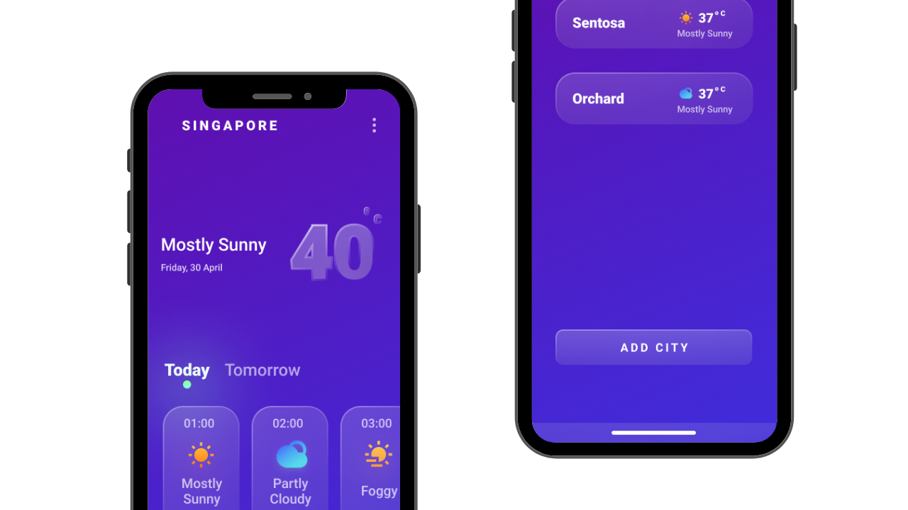

# Design 2 App - Weather App Challenge

Designed by [Aidil Samingan](https://www.linkedin.com/in/aidilsamingan/)

Figma design found [here](https://gum.co/RyUPy).

## Hey there! 👋😁

Thanks for checking out this front-end coding challenge.

[Design 2 App](https://www.reddit.com/r/Design2Flutter/) challenges helps you improve your design to coding Flutter skills by building professional projects.

**To do this challenge, you need a basic understanding of Dart and Flutter.**

## The challenge

Your challenge is to create Weather app and get it looking as close to the design as possible.

## Getting Started

1. [Download](https://github.com/happyharis/weather_app_challenge/archive/refs/heads/master.zip) the starter project.
2. Set up the project with version control.
3. Setup the project challenge however you want.
4. Start coding!

## Completion Levels

Beginner - Completed Static screen (no interactive component)

Advanced - Beginner + Have interactive components (pulling weather data from [OpenWeather API](https://openweathermap.org/api). Tutorial can be found [here](https://medium.com/flutter-community/flutter-weather-app-using-provider-c168d59af837). )

## Suggestions

- Work in a team with friends
- Get your solution as close to the design as possible
- Time yourself. Write down how long you will take, and how long you actually took.

## Submitting your solution

Submit your solution with a screenshot to the [Design2Flutter subreddit](https://www.reddit.com/r/Design2Flutter/) with the solution flair.

Tweet your work on Twitter with the tag [@Design2App](https://twitter.com/Design2Flutter) and hashtag [#design2flutter](https://twitter.com/search?q=%23design2flutter&src=typeahead_click) and include the reddit post.

Share on your LinkedIn and tag [me, Haris Samingan](https://www.linkedin.com/in/haris-samingan-7889b9140/) and I would feature on our [Twitter](https://twitter.com/Design2Flutter) page.
